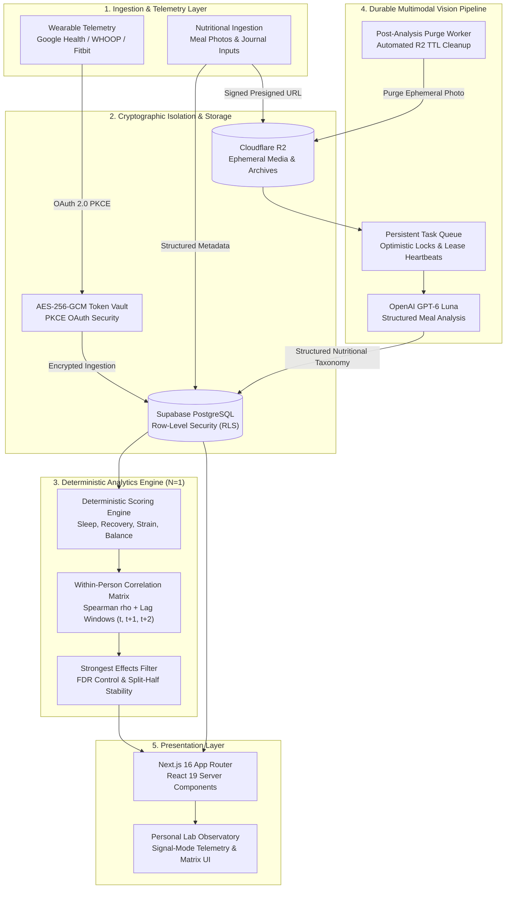

<div align="center">

# Soma

### Personal Biometric Lab & Nutrition Intelligence Platform

[](https://nextjs.org/)
[](https://react.dev/)
[](https://www.typescriptlang.org/)
[](https://tailwindcss.com/)
[](https://supabase.com/)
[](https://www.cloudflare.com/)
[](https://vitest.dev/)
[](https://eslint.org/)

<p align="center">
  <b>Soma</b> is a high-assurance personal health intelligence platform and biometric observatory. It correlates continuous physiological wearable streams (circadian sleep stages, autonomic recovery, cardiovascular strain) with granular nutritional intake and lifestyle interventions, isolating within-person determinants of restorative sleep through rigorous non-parametric statistics and deterministic modeling.
</p>

[System Architecture](#system-architecture) • [Engineering Highlights](#core-engineering-highlights) • [Tech Stack](#tech-stack-overview) • [Local Setup](#getting-started--local-setup) • [Quality Standards](#testing--quality-standards)

---

</div>

## Executive Overview

Modern health and sleep applications often suffer from two systemic engineering defects:
1. **The Ecological Fallacy**: Applying population-level correlations to an individual without accounting for intra-subject variance ($N = 1$).
2. **Generative Hallucination**: Entrusting biometric calculations and statistical inferences to probabilistic Large Language Models.

**Soma** was architected to solve both challenges:
- **Strict Analytical Determinism**: 100% of physiological scores (Sleep Quality, Recovery Index, Cardiovascular Strain, Macronutrient Balance) and correlation metrics are computed deterministically in hardened TypeScript algorithms with zero LLM dependence.
- **$N=1$ Longitudinal Observatory**: Evaluates within-person changes across multi-horizon temporal windows (7d, 15d, 30d, 90d, all-time) using Spearman rank correlation, Benjamini–Hochberg False Discovery Rate (FDR) corrections, non-linear dose-response detection, and chronological stability guards.
- **Resilient Asynchronous Vision Pipeline**: Employs an optimistic-locking persistent worker with GPT-6 Luna for automated nutritional breakdown, bounded retries, structured validation, and post-analysis photo purging.

> *Disclaimer: Soma is a personal analytical laboratory and self-observation platform, not a certified medical device. It analyzes observational associations without claiming clinical etiology.*

---

## System Architecture

The following diagram outlines the end-to-end data lifecycle: from external biometric telemetry and visual ingestion, through cryptographic isolation, deterministic analytical engines, resilient multimodal workers, down to streaming Server Components.



---

## Core Engineering Highlights

### 1. Deterministic Scoring Engine (Zero-Hallucination Guarantees)
Biometric calculations require mathematical precision and auditability. Soma enforces an absolute architectural decoupling between mathematical computations and generative AI:
- **Algorithmic Invariants**: Scoring models for Sleep Architecture (duration, REM/Deep ratios, efficiency, sleep consistency), Autonomic Recovery (HRV RMSSD baseline deviations, resting heart rate deltas), and Daily Strain are purely deterministic functions.
- **Bounded Explanations**: When qualitative synthesis is requested, language models receive strictly pre-calculated numbers as read-only context with rigid schema constraints. The AI can neither calculate nor mutate any score, eliminating numeric hallucinations by design.

### 2. Longitudinal Within-Person Correlations & "Strongest Effects"
Rather than relying on generic averages, Soma models the user as an independent, continuous single-subject experiment:
- **Spearman Rank Correlation Matrix ($\rho$)**: Non-parametric evaluation of pairwise relationships across ordinal and continuous metrics (e.g., late caffeine intake, evening magnesium, meal timing vs. deep sleep percentage or next-day HRV).
- **Lag Modeling ($t, t+1, t+2$)**: Accommodates multi-phase physiological response latencies (same-day impact, next-day recovery deficit, or multi-day rebound effects).
- **False Discovery Rate (FDR) Control**: Applies Benjamini–Hochberg procedures across the correlation matrix to control family-wise error rates across dozens of simultaneous behavioral comparisons.
- **Chronological Stability Guard**: To prevent transient anomalies or localized streaks from generating false positives, candidate relationships must maintain directional stability across at least 2 of 4 distinct chronological quartiles within the active window (7d, 15d, 30d, 90d, all-time).
- **Strongest Effects Extraction**: Ranks statistically significant and practically meaningful determinants, surfacing dominant positive and negative leverage points in the user's daily habits.

### 3. Durable Multimodal Vision Pipeline
Accurate dietary tracking requires robust handling of unstandardized user inputs and third-party API latency:
- **Resilient Asynchronous Task Worker**: Decouples image submission from synchronous HTTP request lifecycles. Jobs are enqueued with optimistic row locking (`locked_at`, lease tokens) and heartbeat renewals, ensuring execution completes safely within serverless budget windows (`maxDuration = 60s`).
- **Crash Recovery & Reconciliation**: Background cron reconcilers (`requeueRetryableMealAnalyses`) automatically recover orphaned or abandoned jobs if an execution container crashes.
- **Bounded GPT-6 Luna Inference**: One OpenAI Responses call runs per durable job attempt. Transient failures are retried by the persisted worker; malformed structured outputs are rejected rather than recorded as meals.
- **Structured Macro Taxonomy**: Ingested meal photos are normalized against comprehensive nutritional taxonomies (calories, protein, fats, net carbs, fiber, micronutrients, processing level, and timing).

### 4. Zero-Leak Privacy Architecture
Personal health information (PHI) demands defense-in-depth security:
- **Authenticated Symmetric Encryption**: OAuth refresh tokens, credentials, and sensitive provider keys are encrypted with **AES-256-GCM** using unique 12-byte initialization vectors (`IV`) and authentication tags (`crypto.ts`).
- **PostgreSQL Row-Level Security (RLS)**: Enforces hard isolation at the database kernel level; zero cross-tenant data leakage is structurally possible.
- **Ephemeral Media Retention**: Meal photos uploaded to Cloudflare R2 exist solely for asynchronous inference; background workers automatically invoke TTL-based cleanup routines (`reconcileMealPhotoPurges`), deleting raw media once dietary parameters are cataloged.
- **Zero-PHI Telemetry**: Health parameters, sleep metrics, and personal records are explicitly scrubbed from server logs, Sentry error contexts, and third-party telemetry.

### 5. Zero-Dependency Local Preview Sandbox
Soma includes a zero-friction evaluation mode for code review, demonstration, and offline engineering:
- Enabled with a single environment flag: `SOMA_LOCAL_PREVIEW=true`.
- Mounts a fully-hydrated in-memory sandbox loaded with synthetically generated longitudinal biometric records, realistic sleep architecture curves, and meal logs.
- Enables complete visual and functional exploration of all pages, graphs, and settings without configuring Google Cloud credentials, Supabase projects, or external AI API keys.

---

## Tech Stack Overview

| Layer | Technology | Version / Configuration | Engineering Rationale |
| :--- | :--- | :--- | :--- |
| **Framework** | Next.js | `16.3.0` (App Router) | High-performance Server Components (RSC), streaming SSR, optimal edge routing. |
| **Runtime & UI** | React | `19.2.8` | Concurrent rendering, native actions, unified server/client transition model. |
| **Language** | TypeScript | `^5.9.0` (Strict Mode) | Comprehensive static analysis, end-to-end type safety, zero `any` tolerance. |
| **Styling** | Tailwind CSS | `4.3.3` | Modern CSS engine, zero-runtime overhead, responsive biometric dashboards. |
| **Database** | Supabase | PostgreSQL 16 + RLS | Relational integrity, temporal queries, strict row-level multi-tenant policies. |
| **Blob Storage** | Cloudflare R2 | S3-Compatible SDK (`@aws-sdk/client-s3`) | High-speed global object storage, zero egress fees, ephemeral retention pipelines. |
| **Vision & AI** | OpenAI Responses | GPT-6 Luna | Meal analysis, Soma chat, and descriptive Analyse summaries. |
| **Testing** | Vitest | `4.1.10` | Blazing-fast native ESM test runner powering **790+ passing unit & integration tests**. |
| **Linting** | ESLint | `^9.0.0` (Flat Config) | Enforces strict code hygiene, modular import boundaries, and architectural invariants. |
| **Deployment** | Vercel | Production Node 24 | Automated Git continuous deployment, edge middleware, isolated serverless workers. |

---

## Getting Started & Local Setup

### Prerequisites
- **Node.js**: `24.0.0` or higher
- **pnpm**: `11.16.0` or higher

### 1. Repository Setup
```bash
git clone https://github.com/Matahari165/Soma.git
cd Soma
pnpm install
```

### 2. Environment Configuration
Create a local environment configuration file:
```bash
cp .env.example .env.local
```

### 3. Instant Local Preview (Zero External Accounts Required)
To inspect and test the full application immediately without external databases or OAuth configurations, set the sandbox preview flag in `.env.local`:
```env
SOMA_LOCAL_PREVIEW=true
```

Then boot the development server:
```bash
pnpm dev
```
Open [http://localhost:3000](http://localhost:3000) to explore the interface with full synthetic biometric datasets.

### 4. Live Production-Connected Mode
For full live operation with third-party providers:
1. Configure your server-only Supabase credentials (`SUPABASE_URL`, `SUPABASE_SERVICE_ROLE_KEY`).
2. Apply the SQL files in `supabase/migrations/` with the Supabase CLI or SQL Editor. `pnpm db:migrate:supabase` migrates D1 data; it does not apply schema migrations.
3. Add your Google OAuth credentials (`GOOGLE_AUTH_CLIENT_ID`, `GOOGLE_AUTH_CLIENT_SECRET`) and token encryption key (`TOKEN_ENCRYPTION_KEY`). The historical `GOOGLE_HEALTH_*` pair remains a fallback.
4. Add Cloudflare R2 credentials (`R2_ACCOUNT_ID`, `R2_ACCESS_KEY_ID`, `R2_SECRET_ACCESS_KEY`, `R2_BUCKET_NAME`) for media processing.
5. Set `OPENAI_API_KEY` for the Soma assistant, Analyse summaries, and meal analysis. `XAI_API_KEY` is only relevant to historical/legacy integrations.

---

## Testing & Quality Standards

Soma adheres to rigorous software verification standards. Every commit and Pull Request is validated through strict continuous integration gates.

```bash
# Run the complete test suite (790+ tests across 130 test files)
pnpm test

# Run static type checking
pnpm typecheck

# Run static linting
pnpm lint

# Run the complete CI verification pipeline (Lint + Typecheck + Tests + Build)
CI=true pnpm verify
```

### Test Suite Distribution
- **Unit & Domain Tests**: Mathematical correctness of scoring algorithms, Spearman rank calculations, FDR corrections, dose-response curve fitting, and date/time window normalization.
- **Pipeline & Worker Tests**: Lease management, optimistic locking, crash recovery, deduplication, retry policies, and automated photo purge TTL reconciliations.
- **Security Tests**: AES-256-GCM encryption/decryption roundtrips, PKCE code verifier/challenge generation, webhook signature validation, and SQL migration sanitization.
- **Component & Integration Tests**: Server and client component rendering, accessibility, responsive breakpoints, loading skeletons, and error boundaries.

---

## Repository Structure

```text
├── src/
│   ├── app/                      # Next.js 16 App Router (Routes, API endpoints, Crons)
│   │   ├── api/                  # REST endpoints (auth, meals, sync, cron workers)
│   │   ├── activity/             # Physical strain & activity telemetry
│   │   ├── analysis/             # Personal Lab & correlation matrix observatory
│   │   ├── meals/                # Nutrition capture, recipe library & journal
│   │   ├── recovery/             # Autonomic nervous system recovery tracking
│   │   └── sleep/                # Sleep architecture & circadian rhythm views
│   ├── components/               # Accessible, signal-driven UI components
│   │   ├── health/               # Biometric radars, trends, and sleep stage graphs
│   │   ├── lab/                  # Correlation matrices, strongest effects cards
│   │   └── settings/             # OAuth connections, data export, AI audit tools
│   ├── domain/                   # Pure business logic & deterministic math
│   │   ├── correlations/         # Spearman rank, lag modeling, matrix computations
│   │   ├── health/               # Wearable normalization & time windowing
│   │   ├── insights/             # Rule-based heuristics & prompt grounding
│   │   └── scores/               # Deterministic scoring engines (Sleep, Recovery, Meals)
│   ├── integrations/             # External SDK clients & adapters
│   │   ├── google-health/        # Health data synchronization & normalization
│   │   ├── meal-analysis/        # Durable GPT-6 Luna provider path
│   │   ├── openai/               # OpenAI SDK bindings & structured vision schemas
│   │   └── xai/                  # Legacy xAI adapters and shared meal contract
│   ├── lib/                      # Cryptographic utilities, env validation, caches
│   ├── repositories/             # Data access layer (Supabase, in-memory preview)
│   └── services/                 # Background workers, retry schedulers, purge daemons
```

---

## License & Intellectual Property

Soma is an open-source personal health engineering project developed by the **Soma Contributors**. Released under the [MIT License](./LICENSE).
